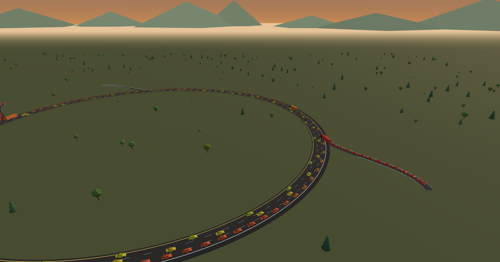

# Highway Traffic Simulator

[](https://markleary.github.io/highway-traffic-simulator/)

**[▶ Try it live](https://markleary.github.io/highway-traffic-simulator/)** — no install, works on phones.

A real-time, browser-based highway traffic simulator. Cars drive around a closed
loop of freeway with 2–4 interchanges (off-ramp + on-ramp each). You control the
knobs; inflow at each on-ramp, share of cars taking each exit, desired speed,
following distance, driver aggressiveness, even the weather - and watch traffic
flow respond live: merge friction, stop-and-go waves, and full-blown phantom jams.

Based on an idea from my childhood: *what actually causes highway traffic?* I
thought about this often, and always wanted to build a simulator like this, but
as a teenager with moderate experience programming in BASIC and Pascal, that
seemed like (and in fact was) an incredibly daunting task. Now, AI has enabled
me to bring my idea to life with a few simple prompts.

## Running

It's a fully static site — no build step. Serve the directory with anything:

```sh
python3 -m http.server 8000
# then open http://localhost:8000
```

(Opening `index.html` via `file://` won't work because the app uses ES modules.)

Append **`?debug`** to the URL for a small diagnostics readout: the deploy
timestamp of the running build, the latest `main` commit, device-detection
verdicts, and the UA/touch/GPU details. It changes no behavior — it exists
for devices without devtools (it's how Tesla in-car support was debugged).

## Deploying to GitHub Pages

Push this repository to GitHub, then: **Settings → Pages → Source: Deploy from a
branch → `main` / root**. That's it — there is nothing to build.

## Controls

- **Scenario dropdown** (top of the panel) — one-click demo setups that stage
  the good regimes and reset: Rush hour, Metered rush hour, Accident storm,
  ACC wave lab, Fundamental diagram, Lane closure crunch, Sudden downpour,
  Ambulance run, and Factory defaults. Each tooltip explains what to watch for.
- **Drag** to orbit, **scroll** to zoom, **Space** to pause (the HUD clock
  shows *paused*, or the ×n rate when time is scaled). Keyboard: **C**
  enters the chase camera (again to switch cars), **V** cycles perspective →
  overhead → chase, **F** toggles an FPS readout, **Esc** exits the chase
  onto an overhead close-up of the spot where you were driving.
- Every panel control has an explainer tooltip: hover it with a mouse, or
  **long-press its label** on a touch screen.
- **Hover any car** for a nameplate readout: its kind and id, current speed,
  and desired speed in parens. **Click any car to crash it** — it blocks its
  lane (optionally dragging a neighbor into a 2-lane pileup) until cleared.
- The **Events** folder stages everything else:
  - **Random breakdown** — a car pulls onto the shoulder, parks with hazards,
    and merges back later, while passing traffic slows down to rubberneck.
  - **Random accident** — a wreck blocks its lane until cleared.
  - **Emergency vehicle** — an ambulance runs the loop well above the speed
    limit while traffic ahead of the siren slows and makes an assertive move
    out of its lane. The ambulance commits to a lane unless an adjacent lane
    offers a meaningful passing gain, so the emergent "move over" corridor is
    decisive without turning the ambulance into a pinball.
  - **Rain storm** — a three-minute storm rolls in, pours, and clears. Wet
    roads mean slower targets, longer following distances, and less grip;
    watch a busy regime tip into stop-and-go as it peaks. A steady **Rain**
    slider sets a permanent climate under the storms.
  - **Work zone** — cone off the innermost lane over a chosen stretch and
    watch zipper merging at the taper, the queue behind it, and the capacity
    drop in the flow chart.
- Cars talk with their lights: **brake lights** come on past an EV-regen-style
  deceleration threshold — and any time a car is crawling or held stopped —
  so a jam wave reads as a red pulse sweeping upstream; **blinkers** show
  intent — merging in from a ramp, working over toward an exit, or wanting a
  lane change that isn't safe yet (that car blinks without moving until a gap
  opens). The ambulance flashes red/blue roof strobes instead.
- The panel (top right) changes the simulation live:
  - **Units** — imperial (mph, default) or metric (km/h)
  - **Simulation** — pause, time scale, number of cars seeded on reset
  - **Road** — loop shape (circle, speedway oval, beltway square, a pinched
    grand-prix circuit, or a **figure eight** whose crossing is a real
    grade-separated overpass — one straight bridges over the other), road
    scale (1–3×: longer stretches between interchanges give jam waves room to
    develop and travel), number of interchanges (2–4 — each shape fits what
    its geometry allows; bigger roads unlock more), and number of lanes (2–4)
  - **Drivers** — percentage of semi trucks in the mix (long, slow, gentle,
    keep right), percentage of cars on **adaptive cruise control** (the angular
    wedge-shaped ones — they never brake harder than physics requires, so they
    absorb stop-and-go waves instead of amplifying them), desired speed, per-car
    speed spread, time headway (following distance), minimum gap, acceleration,
    comfortable braking
  - **Lane changing** — politeness, incentive threshold, safety braking limit
  - **Ramps** — cars/minute entering at each on-ramp, % of traffic taking each
    exit, and **ramp meters**: signals at every on-ramp that release one car
    per green at a rate you set, instead of letting platoons shove into the
    mainline. Queues grow on the ramps, but merges stop triggering waves —
    the counterintuitive classic where admitting *fewer* cars moves *more*.
    The map label at each ramp shows its *measured* flow over the last minute:
    on-ramps show achieved vs. requested (they fall behind when the merge
    queue backs up — or when the meter holds them), exits show what their
    share % currently amounts to in cars/min.
  - **View** — color cars by speed (red = stopped → green = at desired speed),
    **by type** (human / adaptive cruise / truck, matching the legend), or per
    car; live charts, **space-time diagram**, and **fundamental diagram**
    toggles; an FPS counter; a **Scenery** toggle for the landscape dressing
    (trees, hills, clouds — off for modest GPUs); overhead vs. perspective
    camera; and a **chase camera** that rides along behind a random car with a
    working speedometer — hold the mouse to swing the camera around the car
    (Esc to exit). Chase view also shows the vehicle art up close: faceted
    paint, real window panes, low-poly hubs, mirrors, trim, dormant lamp lenses,
    and contact shadows that keep every vehicle planted on the road.
- The space-time diagram (bottom left) is the classic traffic-flow plot: each
  column is one second, bottom-to-top is one lap of the loop, color is speed.
  Individual cars trace bright diagonal lines; jams appear as red bands that
  drift *down-right* — the wave rolls upstream even though every car in it
  drives forward. Ticks on the left edge mark the ramps, a red ✕ marks each
  incident where it happened — in time *and* loop position, so you can watch
  the jam wave spread from it — hovering highlights the matching spot on the
  road, and **clicking flies the camera** to an overhead view of that stretch,
  so you can see live traffic doing whatever the diagram is showing.
- The **fundamental diagram** below it is the other canonical plot: flow vs
  density, one dot per second, accumulated over the whole run. Free-flowing
  traffic rides the dashed diagonal; as the road saturates, the dots bend over
  the crest and slide down the congested branch — the inverted U, traced live.
- The line charts shade **red** while an incident is active and **blue** while
  it rains, so a flow collapse lines up with whatever caused it.

On a phone the layout adapts: the chart panels start hidden and the control
panel starts collapsed (both a tap away), the keyboard tips disappear, and a
**🎥 Chase** button in the corner toggles the ride-along camera — drag on the
screen while chasing to swing around the car. Big touch-first screens that
report themselves as desktops (iPads, the Tesla in-car browser) keep the full
desktop layout but make the same two swaps — Chase button in, keyboard tips
out — and in the Tesla browser, which can't show native dropdown pickers, the
panel's dropdowns open a built-in menu instead. Mid-size windows adapt too:
charts hide below ~900 px so the road keeps the screen, the defaults keep
re-deriving as you resize or rotate (once you flip a toggle yourself, your
setting wins), and the camera re-frames itself around whichever panels are
actually open.

Try it: pick **Rush hour** from the Scenario dropdown and watch jams grow
backwards from the merge points — then pick **Metered rush hour**: same flood,
but the meters hold the merges to a trickle and the mainline runs faster. Give
it a few minutes — the gain builds over the run — then untick Ramp meters
mid-run and watch average speed sag as the merges take back over. Pick
**ACC wave lab**, then
raise the adaptive-cruise share and reset — the jam stripes dissolve; the 2018
Stern experiment, reproducible from your couch. Or pick **Sudden downpour**
and watch a comfortably flowing road collapse into stop-and-go one minute
later when the storm arrives. Pick **Ambulance run** to watch drivers open a
corridor ahead of the siren while the ambulance waits for useful passing gaps
instead of weaving between nearly tied lanes.

## How it works

Each car runs the [Intelligent Driver Model](https://en.wikipedia.org/wiki/Intelligent_driver_model)
(IDM) for acceleration/braking and a simplified [MOBIL](https://traffic-simulation.de)
rule for lane changes. On-ramp cars queue on the ramp and merge into gaps in the
outer lane; cars roll a die upstream of each exit to decide whether to leave, then
work their way to the outer lane in time. Adaptive-cruise cars temper IDM with the
constant-acceleration heuristic, so they absorb perturbations instead of
amplifying them. Rain scales the whole driver model — slower targets, longer
headways, less grip — which is why a stable regime tips when a storm rolls in.
Everything is rendered with three.js (instanced meshes) — the low-poly cars,
trucks, and golden-hour landscape included — so thousands of cars stay smooth.
The landscape uses sparse, broad faceted ground relief, faint wheel-wear
ribbons, and a polygonal sun halo to keep the diorama graphic without looking
busy. Rain
grades the whole scene: the sky dome, terrain, clouds, hills, and fog all darken
with the same live rain level that drives the physics.

## Roadmap

The original roadmap — including the latest emergency-vehicle behavior polish —
has shipped. Ideas welcome.
